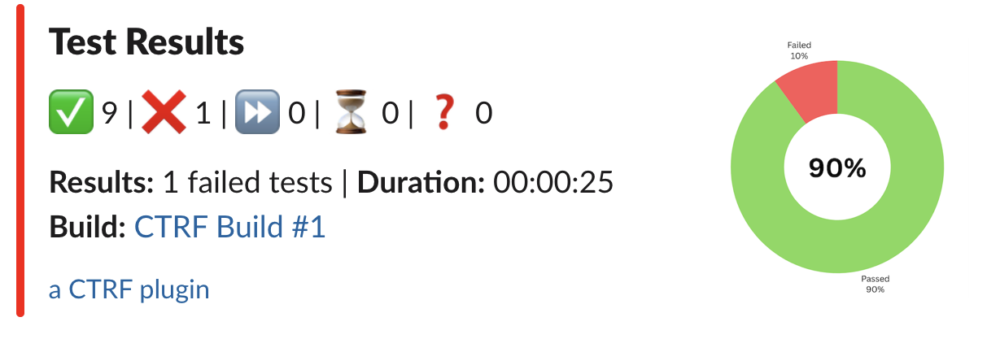
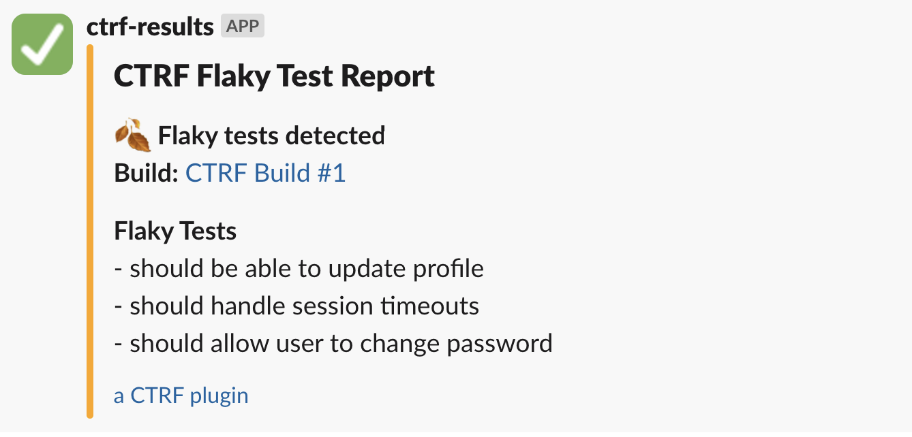

# Slack Test Results Notification

> Send Slack message with test result from popular testing frameworks



## Help us grow CTRF

⭐ **If you find this project useful, please consider following the [CTRF organisation](https://github.com/ctrf-io) and giving this repository a star** ⭐

**It means a lot to us and helps us grow this open source library.**

## Features

- **Send Test Results to Slack**: Automatically send test results to a Slack channel.
- **Send Flaky Test Details to Slack**: Automatically send flaky test details to a Slack channel.
- **Conditional Notifications**: Use the `--onFailOnly` option to send notifications only if tests fail.

## Setup

You'll need a CTRF report generated by your testing framework. [CTRF reporters](https://github.com/orgs/ctrf-io/repositories) are available for most testing frameworks and easy to install.

**No CTRF reporter? No problem!**

Use [junit-to-ctrf](https://github.com/ctrf-io/junit-to-ctrf) to convert a JUnit report to CTRF.

### Create a Slack Incoming Webhook

1. Go to the [Slack API: Incoming Webhooks](https://api.slack.com/messaging/webhooks) page.
2. Click on "Create a Slack App" or use an existing app.
3. Add the "Incoming Webhooks" feature to your app.
4. Activate the Incoming Webhook and add a new webhook to your workspace.
5. Copy the webhook URL provided.

### Set the Environment Variable

Set the webhook URL as an environment variable in your shell or CI environment:

```sh
export SLACK_WEBHOOK_URL='https://hooks.slack.com/services/your/webhook/url'
```

Make sure to replace `'https://hooks.slack.com/services/your/webhook/url'` with your actual webhook URL.

You might want to store the webhook URL as a secret.

## Usage

To send the test results summary to Slack:

```sh
npx slack-ctrf results /path/to/ctrf-report.json
```


To send flaky test report to Slack:

```sh
npx slack-ctrf flaky /path/to/ctrf-report.json
```



### Send Only on Failures

To send the test results summary to Slack only if there are failed tests, use the `--onFailOnly` option:

```sh
npx slack-ctrf results /path/to/ctrf-file.json --onFailOnly
```

or using the alias:

```sh
npx slack-ctrf results /path/to/ctrf-file.json -f
```

### Custom Notification Title

You can choose a custom title for your notification, use the `--title` option:

```sh
npx slack-ctrf results /path/to/ctrf-file.json --title "Custom Title"
```

or using the alias:

```sh
npx slack-ctrf results /path/to/ctrf-file.json -t "Custom Title"
```

## Options

- `--onFailOnly, -f`: Send notification only if there are failed tests.
- `--title, -t`: Title of the notification.

## Merge reports

You can merge reports if your chosen reporter generates multiple reports through design, parallelisation or otherwise.

The [ctrf-cli](https://github.com/ctrf-io/ctrf-cli) package provides a method to merge multiple ctrf json files into a single file.

After executing your tests, use the following command:

```sh
npx ctrf merge <directory>
```

Replace directory with the path to the directory containing the CTRF reports you want to merge.

## What is CTRF?

CTRF is a universal JSON test report schema that addresses the lack of a standardized format for JSON test reports.

**Consistency Across Tools:** Different testing tools and frameworks often produce reports in varied formats. CTRF ensures a uniform structure, making it easier to understand and compare reports, regardless of the testing tool used.

**Language and Framework Agnostic:** It provides a universal reporting schema that works seamlessly with any programming language and testing framework.

**Facilitates Better Analysis:** With a standardized format, programatically analyzing test outcomes across multiple platforms becomes more straightforward.

## Support Us

If you find this project useful, consider giving it a GitHub star ⭐ It means a lot to us.
