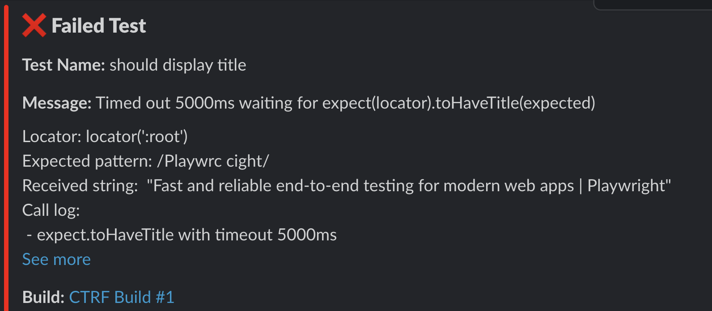

# Slack Test Results Notification

> Send Slack message with test results from popular testing frameworks

A Slack test reporting tool that supports all major testing frameworks.
Generate, publish and alert your team with detailed test results, including
summaries, in-depth reports, failed test analyses, flaky test detection and AI
analyses directly to your chosen Slack channel.


## **⭐⭐ If you find this project useful, consider giving it a GitHub star ⭐⭐**

Support our mission to enhance test reporting in Slack by:

- **⭐ Starring this repository to show your support. ⭐**
- **🙌 Following our [GitHub page here](https://github.com/ctrf-io) 🙌**

Building for the community takes time, and a small gesture of support is a
rewarding boost that makes it all worthwhile.

Thank you! Your support is invaluable to us! 💙

Built and maintained by [Matthew Thomas](https://github.com/ma11hewthomas)

Contributions are very welcome!

## Features

- **Send Test Results to Slack**: Automatically send test results to a Slack channel.
- **Send Flaky Test Details to Slack**: Automatically send flaky test details to a Slack channel.
- **Send AI Test Summary to Slack**: Automatically send AI test summary to a Slack channel.
- **Conditional Notifications**: Use the `--onFailOnly` option to send notifications only if tests fail.

## Setup

You'll need a CTRF report generated by your testing framework. [CTRF reporters](https://github.com/orgs/ctrf-io/repositories) are available for most testing frameworks and easy to install.

**No CTRF reporter? No problem!**

Use [junit-to-ctrf](https://github.com/ctrf-io/junit-to-ctrf) to convert a JUnit report to CTRF.

### Create a Slack Incoming Webhook

1. Go to the [Slack API: Incoming Webhooks](https://api.slack.com/messaging/webhooks) page.
2. Click on "Create a Slack App" or use an existing app.
3. Add the "Incoming Webhooks" feature to your app.
4. Activate the Incoming Webhook and add a new webhook to your workspace.
5. Copy the webhook URL provided.

### Set the Environment Variable

Set the webhook URL as an environment variable in your shell or CI environment:

```sh
export SLACK_WEBHOOK_URL='https://hooks.slack.com/services/your/webhook/url'
```

Make sure to replace `'https://hooks.slack.com/services/your/webhook/url'` with your actual webhook URL.

You might want to store the webhook URL as a secret.

## Usage

### Results

To send the test results summary to Slack:

```sh
npx slack-ctrf results /path/to/ctrf-report.json
```


### AI Summary

To send AI failed test summary to Slack:

```sh
npx slack-ctrf ai /path/to/ctrf-report.json
```

Use `--consolidated` argumement to send a single message with all AI summaries

```sh
npx slack-ctrf ai /path/to/ctrf-report.json --consolidated
```


See the [AI Test Reporter](https://github.com/ctrf-io/ai-test-reporter) to add AI summaries to your CTRF report

### Flaky

To send flaky test report to Slack:

```sh
npx slack-ctrf flaky /path/to/ctrf-report.json
```


## Failed

To send failed test report to Slack:

```sh
npx slack-ctrf failed /path/to/ctrf-report.json
```

Use `--consolidated` argumement to send a single message with all AI summaries

```sh
npx slack-ctrf failed /path/to/ctrf-report.json --consolidated
```



### Send Only on Failures

To send the test results summary to Slack only if there are failed tests, use the `--onFailOnly` option:

```sh
npx slack-ctrf results /path/to/ctrf-file.json --onFailOnly
```

or using the alias:

```sh
npx slack-ctrf results /path/to/ctrf-file.json -f
```

### Custom Notification Title

You can choose a custom title for your notification, use the `--title` option:

```sh
npx slack-ctrf results /path/to/ctrf-file.json --title "Custom Title"
```

or using the alias:

```sh
npx slack-ctrf results /path/to/ctrf-file.json -t "Custom Title"
```

### Add Prefix and Suffix

Add custom markdown text to as a prefix, or suffix to the message:

```sh
npx slack-ctrf results /path/to/ctrf-file.json -p "prefix" -s "suffix"
```

Read about compatible [markdown](https://api.slack.com/reference/surfaces/formatting#basic-formatting) 

## Options

- `--onFailOnly, -f`: Send notification only if there are failed tests.
- `--title, -t`: Title of the notification.
- `--prefix, -p`: Custom markdown text to add as a prefix to the message
- `--suffix, -p`: Custom markdown text to add as a prefix to the message

## Merge reports

You can merge reports if your chosen reporter generates multiple reports through design, parallelisation or otherwise.

The [ctrf-cli](https://github.com/ctrf-io/ctrf-cli) package provides a method to merge multiple ctrf json files into a single file.

After executing your tests, use the following command:

```sh
npx ctrf merge <directory>
```

Replace directory with the path to the directory containing the CTRF reports you want to merge.

## Programmatic Usage

You can use the package programmatically to send notifications to Slack. To install the package, run:

```sh
npm install slack-ctrf
```

The package exports the following functions:

- `sendTestResultsToSlack`
- `sendFlakyResultsToSlack`
- `sendFailedResultsToSlack`
- `sendAISummaryToSlack`

```ts
import { sendTestResultsToSlack } from 'slack-ctrf';

sendTestResultsToSlack(report);
```

## What is CTRF?

CTRF is a universal JSON test report schema that addresses the lack of a standardized format for JSON test reports.

**Consistency Across Tools:** Different testing tools and frameworks often produce reports in varied formats. CTRF ensures a uniform structure, making it easier to understand and compare reports, regardless of the testing tool used.

**Language and Framework Agnostic:** It provides a universal reporting schema that works seamlessly with any programming language and testing framework.

**Facilitates Better Analysis:** With a standardized format, programatically analyzing test outcomes across multiple platforms becomes more straightforward.

## Support Us

If you find this project useful, consider giving it a GitHub star ⭐ It means a lot to us.
