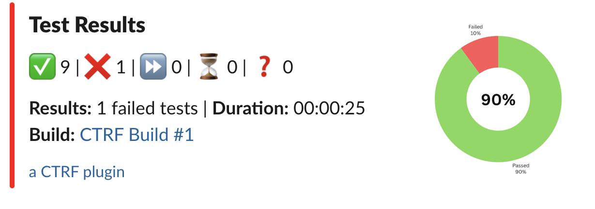
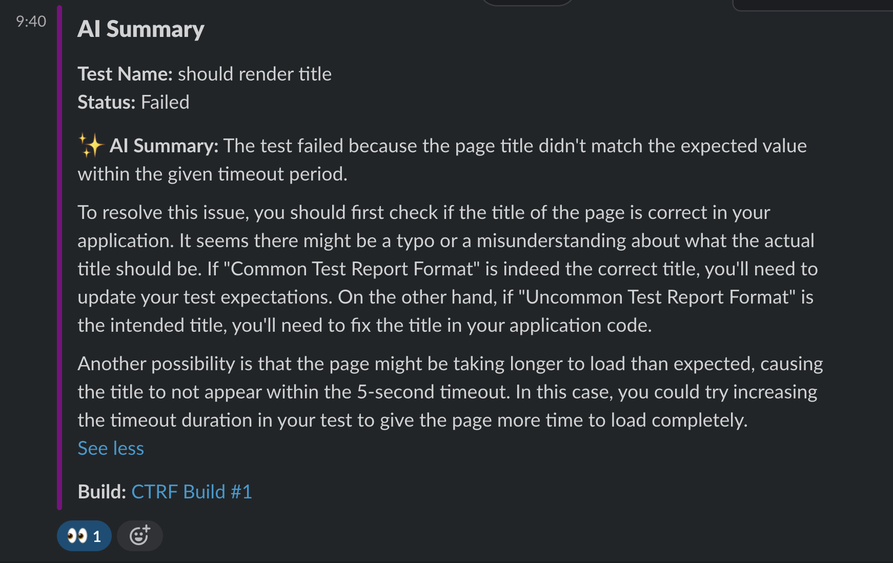
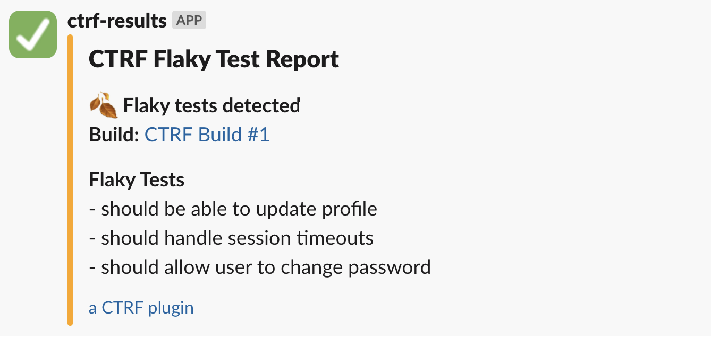
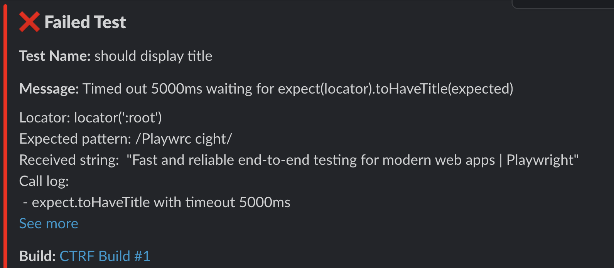

# Slack Test Results Notification

> Send Slack message with test results from popular testing frameworks

A Slack test reporting tool that supports all major testing frameworks.
Generate, publish and alert your team with detailed test results, including
summaries, in-depth reports, failed test analyses, flaky test detection and AI
analyses directly to your chosen Slack channel.

<div align="center">
<div style="padding: 1.5rem; border-radius: 8px; margin: 1rem 0; border: 1px solid #30363d;">
<span style="font-size: 23px;">💚</span>
<h3 style="margin: 1rem 0;">CTRF tooling is open source and free to use</h3>
<p style="font-size: 16px;">You can support the project with a follow and a star</p>

<div style="margin-top: 1.5rem;">
<a href="https://github.com/ctrf-io/slack-test-reporter">

</a>
<a href="https://github.com/ctrf-io">

</a>
</div>
</div>

<p style="font-size: 14px; margin: 1rem 0;">

Contributions are very welcome! <br/>
Explore more <a href="https://www.ctrf.io/integrations">integrations</a> <br/>
<a href="https://app.formbricks.com/s/cmefs524mhlh1tl01gkpvefrb">Let us know your thoughts</a>.

</p>
</div>

## Features

- **Send Test Results to Slack**: Automatically send test results to a Slack channel.
- **Send Flaky Test Details to Slack**: Automatically send flaky test details to a Slack channel.
- **Send AI Test Summary to Slack**: Automatically send AI test summary to a Slack channel.
- **Send Failed Test Details to Slack**: Automatically send failed test details to a Slack channel.
- **Build your own Slack message**: Create and customize your own Slack test reports with our flexible templating system.
- **Threading Support**: Post messages as threaded replies to an existing thread, or auto-thread multi-failure reports.
- **Status Reactions**: Automatically add a pass/fail emoji reaction to your Slack message.
- **Tagging**: Tag users, channels and groups in the message.
- **Conditional Notifications**: Use the `--onFailOnly` option to send notifications only if tests fail.
- **Dry Run**: Preview the Slack message payload without sending it.



## Setup

You'll need a CTRF report generated by your testing framework. [CTRF reporters](https://github.com/orgs/ctrf-io/repositories) are available for most testing frameworks and easy to install.

**No CTRF reporter? No problem!**

Use [junit-to-ctrf](https://github.com/ctrf-io/junit-to-ctrf) to convert a JUnit report to CTRF.

### Use an Incoming Webhook

1. Go to the [Slack API: Incoming Webhooks](https://api.slack.com/messaging/webhooks) page.
2. Click on "Create a Slack App" or use an existing app.
3. Add the "Incoming Webhooks" feature to your app.
4. Activate the Incoming Webhook and add a new webhook to your workspace.
5. Copy the webhook URL provided.

Set the webhook URL as an environment variable in your shell or CI environment:

```sh
export SLACK_WEBHOOK_URL='https://hooks.slack.com/services/your/webhook/url'
```

Make sure to replace `'https://hooks.slack.com/services/your/webhook/url'` with your actual webhook URL.

You might want to store the webhook URL as a secret.

You can also use the `--webhook-url` option to set the webhook URL.

### Use an OAuth Token

1. Go to the [Slack API: Slack Apps](https://docs.slack.dev/quickstart) page.
2. Follow the instructions to create a Slack App.
3. Add the 'chat:write' scope to your app.
4. Generate a Bot OAuth Token.
5. Invite the bot to your channel.
6. Copy the Bot User OAuth Token.

Set the OAuth Token as an environment variable in your shell or CI environment:

```sh
export SLACK_OAUTH_TOKEN='xoxb-your/bot/user/oauth/token'
```

You must also set the channel ID as an environment variable when using the OAuth Token:

```sh
export SLACK_CHANNEL_ID='C0123456789'
```

You can also use the `--oauth-token` and `--channel-id` options to set the OAuth Token or channel ID respectively.

## Usage

You can use a glob pattern or a single file path to send the test results summary to Slack.

### Results

To send the test results summary to Slack:

```sh
npx slack-ctrf results /path/to/ctrf-report.json
```

You can use a glob pattern with multiple files which will be merged together:

```sh
npx slack-ctrf results "ctrf/*.json"
```


### AI Summary

To send AI failed test summary to Slack:

```sh
npx slack-ctrf ai /path/to/ctrf-report.json
```

Use `--consolidated` argumement to send a single message with all AI summaries

```sh
npx slack-ctrf ai /path/to/ctrf-report.json --consolidated
```



See the [AI Test Reporter](https://github.com/ctrf-io/ai-test-reporter) to add AI summaries to your CTRF report

### Flaky

To send flaky test report to Slack:

```sh
npx slack-ctrf flaky /path/to/ctrf-report.json
```



## Failed

To send failed test report to Slack:

```sh
npx slack-ctrf failed /path/to/ctrf-report.json
```

Use `--consolidated` argumement to send a single message with all AI summaries

```sh
npx slack-ctrf failed /path/to/ctrf-report.json --consolidated
```



## Build your own Slack message

The `custom` method lets you build your own report using a Handlebars
template allowing you to leverage data from your CTRF report to build a dynamic Slack message. The template can be a Block Kit JSON or Slack flavored markdown context block.

To send a message to Slack using a custom Handlebars template:

```sh
npx slack-ctrf custom /path/to/ctrf-report.json /path/to/template.hbs --blockkit
```

```sh
npx slack-ctrf custom /path/to/ctrf-report.json /path/to/template.hbs --markdown
```

The template has access to the entire CTRF report data through the `ctrf` variable. For example:

```handlebars
Tests: {{ctrf.summary.tests}}
```

```markdown
Tests: 100
```

### Block Kit JSON

Provide a Block Kit JSON template to the `--blockkit` option. See the [Slack Block Kit Documentation](https://api.slack.com/block-kit) and [Slack Block Kit Builder](https://api.slack.com/tools/block-kit-builder) for help creating a template.

The Block Kit JSON template can include Handlebars syntax to access test report data. For example:

```json
{
  "blocks": [
    {
      "type": "header",
      "text": {
        "type": "plain_text",
        "text": "Test Results: {{ctrf.summary.total}} tests run"
      }
    },
    {
      "type": "section",
      "text": {
        "type": "mrkdwn",
        "text": "*Passed:* {{ctrf.summary.passed}}\n*Failed:* {{ctrf.summary.failed}}"
      }
    }
  ]
}
```

See the [templates](templates) directory for examples.

### Slack Flavored Markdown

Provide a Slack flavored markdown template to the `--markdown` option. See the [Slack Flavored Markdown Documentation](https://api.slack.com/block-kit) for help creating a template.

See the [templates](templates) directory for examples.

### Handlebars

Handlebars is a simple templating language that lets you insert data into your
message in a declarative way. You can use placeholders, conditionals, and loops
to dynamically generate content based on your test results.

## CTRF Properties

The `ctrf` object provides access to your test results data. Here are the common
properties:

### Summary (`ctrf.summary`)

- `tests`: Total number of tests
- `passed`: Number of passed tests
- `failed`: Number of failed tests
- `skipped`: Number of skipped tests
- `start`: Test suite start time
- `stop`: Test suite end time

### Individual Tests (`ctrf.tests`)

An array of test results, each containing:

- `name`: Test name
- `status`: Test status ("passed", "failed", "skipped")
- `message`: Test output/error message
- `duration`: Test duration in milliseconds
- `retries`: Number of retries (for flaky tests)

Example accessing test data:

```hbs
{{#each ctrf.tests}}
  Test: {{this.name}} - Status: {{this.status}}
{{/each}}
```

### Helpers

The template can include helpers to format the data. There is a wide range of helpers available from CTRF custom helpers [handlebars-helpers-ctrf](https://github.com/ctrf-io/handlebars-helpers), [handlebars built-in helpers](https://handlebarsjs.com/guide/#helpers) and [slack-ctrf helpers](src/handlebars/helpers)

## Send Only on Failures

To send the test results summary to Slack only if there are failed tests, use the `--onFailOnly` option:

```sh
npx slack-ctrf results /path/to/ctrf-file.json --onFailOnly
```

or using the alias:

```sh
npx slack-ctrf results /path/to/ctrf-file.json -f
```

## Custom Notification Title

You can choose a custom title for your notification, use the `--title` option:

```sh
npx slack-ctrf results /path/to/ctrf-file.json --title "Custom Title"
```

or using the alias:

```sh
npx slack-ctrf results /path/to/ctrf-file.json -t "Custom Title"
```

## Add Prefix and Suffix

Add custom markdown text to as a prefix, or suffix to the message:

```sh
npx slack-ctrf results /path/to/ctrf-file.json -p "prefix" -s "suffix"
```

Read about compatible [markdown](https://api.slack.com/reference/surfaces/formatting#basic-formatting)

## Tagging a user, channel or group

You can tag users, channels or groups in the message by using the `--prefix` or `--suffix` options.

You need to a Slack user ID, channel ID or group ID.

You can find your user ID by:

- Clicking on your profile picture in Slack
- Clicking the three dots (...)
- Selecting "Copy member ID"

Once you have your user ID (which will look something like U01ABC123DE), use that in your command instead of your display name:

```sh
npx slack-ctrf results /path/to/ctrf-file.json -s "<@U0123456789> please review the results"
```

You can also tag a channel by using the `#` symbol with the channel ID:

```sh
npx slack-ctrf results /path/to/ctrf-file.json -s "<#C0123456789> please review the results"
```

And finally, you can tag a group by using the `\!subteam^` symbol with the group ID:

```sh
npx slack-ctrf results /path/to/ctrf-file.json -s "<\!subteam^0123456789> please review the results"
```

## Threading Support

You can post messages as threaded replies to group related messages together.

### Post to a Thread

Use the `--thread-ts` (or `--tt`) option to reply to an existing thread:

```sh
npx slack-ctrf results /path/to/ctrf-report.json --thread-ts "1234567890.123456"
```

### Get Message Timestamp

Use the `--return-ts` (or `--rt`) flag to output the message timestamp. This is useful for capturing the timestamp of a parent message to thread subsequent commands under it:

```sh
# Send initial summary and capture its timestamp
THREAD_TS=$(npx slack-ctrf results /path/to/ctrf-report.json --return-ts)

# Thread a follow-up report
npx slack-ctrf failed /path/to/ctrf-report.json --thread-ts "$THREAD_TS"
```

**Note:** `--return-ts` only works with OAuth token authentication (not webhooks).

### Reply Broadcast

To send a threaded reply and also broadcast it to the main channel, use the `--reply-broadcast` (or `--rb`) flag:

```sh
npx slack-ctrf results /path/to/ctrf-report.json --thread-ts "1234567890.123456" --reply-broadcast
```

### Auto-Threading

When using the `failed` or `ai` commands with multiple failures, you can enable auto-threading to automatically post a summary to the channel and thread individual failure details under it. Use the `--auto-thread` (or `--at`) flag to opt in:

```sh
npx slack-ctrf failed /path/to/ctrf-report.json --auto-thread
```

## Status Reactions

You can automatically add a reaction emoji to your Slack message based on the test results using the `--react` (or `-r`) flag.

- ❌ Added if there are failed tests.
- ✅ Added if all tests passed.

You can customize the emojis using `--failed-emoji` and `--passed-emoji`:

```sh
npx slack-ctrf results /path/to/ctrf-report.json --react --failed-emoji "fire" --passed-emoji "rocket"
```

**Note:** Reactions require OAuth token authentication (not webhooks), as the `reactions.add` API is not available via webhooks.

## Dry Run

To preview the Slack message payload without sending it, use the `--dry-run` (or `--dr`) flag:

```sh
npx slack-ctrf results /path/to/ctrf-report.json --dry-run
```

The payload will be printed to stdout. No message is sent to Slack.

## Limit Failure Reports

When using the `failed` or `ai` commands, you can cap the number of individual failure messages sent with `--max-reports` (or `--mr`):

```sh
npx slack-ctrf failed /path/to/ctrf-report.json --max-reports 5
```

Defaults to 10. If more tests fail than the limit, a notice is appended listing the overflow count.

## Options

- `--onFailOnly, -f`: Send notification only if there are failed tests.
- `--title, -t`: Title of the notification.
- `--prefix, -p`: Custom markdown text to add as a prefix to the message
- `--suffix, -s`: Custom markdown text to add as a suffix to the message
- `--webhook-url, -w`: Incoming webhook URL
- `--oauth-token, -o`: OAuth token
- `--channel-id, -ch`: Channel ID
- `--thread-ts, --tt`: Thread timestamp to reply to an existing thread
- `--return-ts, --rt`: Output the message timestamp (OAuth only)
- `--reply-broadcast, --rb`: Also send threaded reply to the channel
- `--auto-thread, --at`: Thread multi-message reports under a summary (default: false)
- `--react, -r`: Add a reaction emoji based on pass/fail result (OAuth only)
- `--failed-emoji`: Emoji name for failed results (default: "x")
- `--passed-emoji`: Emoji name for passed results (default: "white_check_mark")
- `--dry-run, --dr`: Print the Slack message payload instead of sending it
- `--max-reports, --mr`: Maximum number of individual failure messages to send (default: 10)
- `--max-retries`: Number of retry attempts on rate limit or timeout errors (default: 3)

## Environment Variables

CLI flags take precedence over environment variables.

- `SLACK_WEBHOOK_URL`: Incoming webhook URL
- `SLACK_OAUTH_TOKEN`: OAuth token
- `SLACK_CHANNEL_ID`: Channel ID
- `SLACK_THREAD_TS`: Thread timestamp to reply to an existing thread
- `SLACK_AUTO_THREAD`: Set to `true` to enable automatic threading
- `SLACK_REACT`: Set to `true` to enable emoji reactions
- `SLACK_FAILED_EMOJI`: Emoji name for failed results (default: "x")
- `SLACK_PASSED_EMOJI`: Emoji name for passed results (default: "white_check_mark")
- `SLACK_DRY_RUN`: Set to `true` to enable dry run mode
- `SLACK_MAX_RETRIES`: Number of retry attempts (default: 3)

## Merge reports

You can merge reports if your chosen reporter generates multiple reports through design, parallelisation or otherwise.

If you use a glob pattern, the reports will be merged automatically.

Otherwise, the [ctrf-cli](https://github.com/ctrf-io/ctrf-cli) package provides a method to merge multiple ctrf json files into a single file.

After executing your tests, use the following command:

```sh
npx ctrf merge <directory>
```

Replace directory with the path to the directory containing the CTRF reports you want to merge.

## Programmatic Usage

You can use the package programmatically to send notifications to Slack. To install the package, run:

```sh
npm install slack-ctrf
```

see [API documentation](docs/functions) for more details.

## Configuration

You can skip features by using environment variables.

```sh
export CTRF_SKIP_FOOTER=true # Skip the footer
export CTRF_SKIP_CHART=true # Skip the chart
export CTRF_SKIP_WARNINGS=true # Skip the build warnings
```

## Development

Contributions are very welcome!

### Run all checks

```sh
npm run all
```

### Run E2E

If you have a Slack account to test with, set the environment variables test:

```sh
export SLACK_WEBHOOK_URL=https://hooks.slack.com/services/your/webhook/url
# or
export SLACK_OAUTH_TOKEN=xoxb-your/bot/user/oauth/token
export SLACK_CHANNEL_ID=C0123456789
```

Run the E2E tests:

```sh
npm run e2e
```

or test a single command:

```sh
node dist/cli.js results "ctrf-report.json"
```

## What is CTRF?

CTRF is a universal JSON test report schema that addresses the lack of a standardized format for JSON test reports.

**Consistency Across Tools:** Different testing tools and frameworks often produce reports in varied formats. CTRF ensures a uniform structure, making it easier to understand and compare reports, regardless of the testing tool used.

**Language and Framework Agnostic:** It provides a universal reporting schema that works seamlessly with any programming language and testing framework.

**Facilitates Better Analysis:** With a standardized format, programatically analyzing test outcomes across multiple platforms becomes more straightforward.

## Support Us

If you find this project useful, consider giving it a GitHub star ⭐ It means a lot to us.

